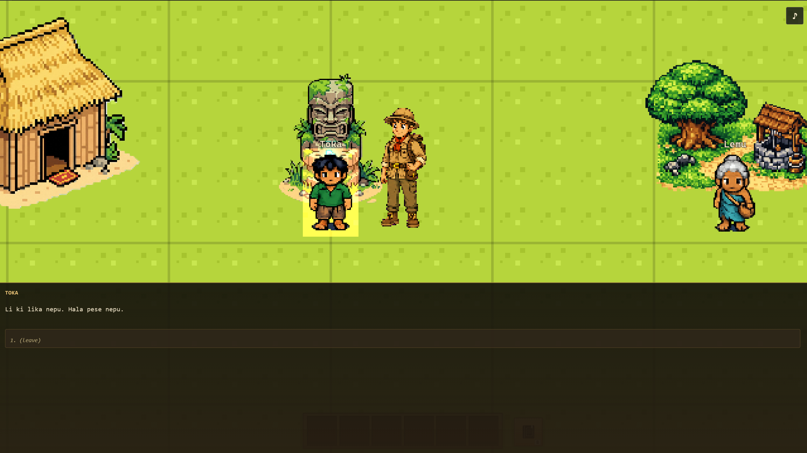
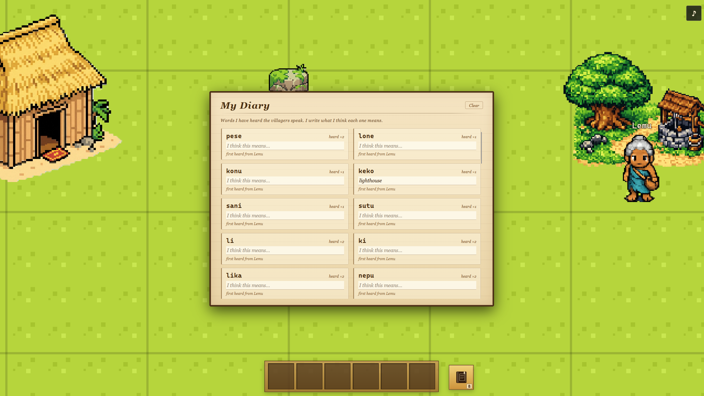

# Fledgling

A 5–10 minute browser game where every playthrough invents a new language and asks you to decipher it. Built for the AI Engineer Hackathon Singapore, 2026-05-09.

```
Run #1, Naro the baker:    "tova-n  ki-ra  ne-ko  sov."
Run #2, Naro the baker:    "jino-fas  vetaru  no-pa."
Run #3, Naro the baker:    "se kuru-le  pana-mi."
```

Same baker. Same line. (She wants wood.) Different language, every time you load the page.



You crash on an island. **Five villagers** speak a language no human has ever spoken before. Phonology, lexicon, grammar — all generated the moment you load the page. They want wood, oil, and flint to light the lighthouse beacon. Nobody will translate for you. Your only tool is a diary you fill in yourself by hovering over words and writing what you think they mean.

Guess right and the world responds. The baker hands you a bundle of logs. Guess wrong and she tilts her head and waits. The game never tells you which.

When the beacon lights and you climb to the lighthouse, the chief speaks to you over a live voice channel in that same generated tongue, and you answer her with your own voice. Then you pick: leave on the boat at first light, or stay.

## Why this isn't Duolingo

Duolingo teaches you Spanish. Fledgling teaches you how to figure out *any* language without help, by giving you one and refusing to translate it. The thing you practice is the thing field linguists do when they sit down with a community whose language has never been written: listen, guess, write down what you think a word means, see whether the world agrees.

The language is invented per run. You can't have studied it. You can't look it up. The 50-word lexicon, the suffix rules, the SOV word order, the phonotactics get generated procedurally when the page loads, then voiced by ElevenLabs in voices we hand-tuned per villager. The game is the same every run. The language never is.

You don't need a linguistics background. There's no tutorial. A 17-second prologue tells you you've crashed, that nobody speaks your language, that you can hover any word to write what you think it means, and that your guesses are the only translation you're going to get. Then **Pemi**, a child, runs across the sand to greet you, and the village starts teaching you itself.

It's also cosy. Nothing punishes you. A wrong guess loops back. The method you use is the same one used to document endangered languages, scaled down to something you can finish on a coffee break.

## A round of play

**Naro the baker** walks over. She says: *"tova-n ki-ra ne-ko sov."*

You hover *tova-n*. The word she said while looking at the basket of logs you walked past on the way in. You write **wood?** in the diary.

You hover *ki-ra*. She said it gesturing at her own chest. **me?**



The dialogue overlay gives you three response frames, all encoded into the same run's language. You pick the one whose gloss in your diary reads roughly *"I give wood to you."*

She nods. The bundle of logs leaves your inventory and a +1 flickers next to her name.

That's the loop. Fifteen exchanges later you're starting to feel the shape of it. By the time you climb the lighthouse, you can hold a real conversation with **Hala the chief** — out loud, in a language you couldn't have heard before this morning.

## The cast

| Name | Archetype | Where | Role |
|---|---|---|---|
| **Pemi** | child | Beach (crash-site shore) | Phase A: teaches anchor words by gesture (Hi, Go, Me, You, Want) |
| **Naro** | elder woman | Village (shrine) | Holds an item; colour, tells stories of the predecessor |
| **Lemu** | elder woman | Village (well) | Holds an item; chatty |
| **Toka** | man | Forest (cliff path) | Holds an item; terse |
| **Hala** | chief | Lighthouse (south) | Climax NPC. Speaks live (Gemini `flash-3.1-live`). Holds the leave/stay question |

## The AI stack

Seven AI services. Each one earns its slot.

| Service | Role | Why this one |
|---|---|---|
| **GPT-5.5** | Procedural language generator | Generates a full `LanguageSpec` per seed: phonology, 50-word lexicon, morphology rules, syntax. Same seed, same language — share a tongue by sharing a seed. (Local PRNG fallback ships alongside for offline determinism.) |
| **Groq (Gemma 4 70B)** | NPC frame-to-frame responder | When an NPC "hears" the player's frame, Groq emits a response frame in JSON-object mode, validated against `validateFilledFrame` with a retry-on-error loop. Sub-second turnaround is what stops village conversations turning into lecture slides. |
| **ElevenLabs Turbo v2.5** | Streaming TTS for every village line | Each NPC has a hand-tuned voice profile. Lines stream over a stream-input websocket so audio starts within 300 ms. Lipsync timings come back in the same stream. |
| **Gemini 3.1 Flash Live** | Bidirectional voice for the climax | At the lighthouse you stop picking from menus and talk. Mic up as Int16 PCM, Hala's voice down. She knows what items you brought, whether you read the predecessor's journal, and the predecessor's generated name — all stitched into the system prompt from live world state. |
| **Convex** | Real-time NPC state and dialogue event log | Every NPC's position, action, inventory, plus the world clock, all live in Convex. The Phaser engine subscribes; tick updates land in the scene graph at 30 in-game minutes per 2 seconds wall-clock. The dialogue log doubles as the source for ambient overhearing. |
| **Fal AI (Image v2)** | Pixel-art sprite sheets and walk-cycle animations (hard-coded for this demo) | Hosts a pixel-art-specific model that holds 32×32 cleanly where SDXL gives sub-pixel mush. For the demo, every asset was generated up-front via Fal's Image v2 and committed to the repo — a manifest-driven `scripts/gen-sprites.ts` runs each NPC × pose × held-object combination with a pinned per-character seed, so Naro stays Naro across her walk cycle. Animations are discrete keyframes (*foot forward, planted, back*) with shared seeds — we tried CogVideoX-style continuous output first and got beautiful but inconsistent drift between frames. A Sharp pipeline quantises to a 16-colour ramp and packs into one texture atlas with type-safe keys regenerated into `src/assets/keys.ts`. **The plan is to generate assets on the fly with a fixed style prompt** so each run's invented nouns get bespoke sprites that match the village's vibe — for the hackathon we hard-coded the output to keep the loading screen under its two-second budget. |
| **Anthropic Claude** | Design-time co-author | Six sibling Claude Code sessions ran in parallel during the hackathon (engine, language, voice, story, sim, orchestrator), coordinating through `agents/` and an Obsidian Kanban. The repo is the artefact of that collaboration. |

**Why two TTS providers?** Village lines are short and pre-written, so ElevenLabs (fast first-byte, per-NPC voice) is the right tool. The lighthouse is the one place we want the player to actually speak, so it gets Gemini Live, which can listen back. One tool for both jobs would have meant compromising one of them.

## The frame system (the bit we're proudest of)

A typed semantic interlingua is the thing that makes the rest possible. Every utterance — NPC line or player choice — is authored once as an English string plus a *frame*: a typed predicate-and-roles object. The language module encodes a frame into the run's language, and decodes back.

```
GIVE(agent: self, recipient: listener, theme: WOOD)  [imperative]
   ↓ encodeFrame(spec)
"tova-n ki-ra ne-ko sov"     ← in this run's language
   ↑ decodeFrame(spec)
GIVE(agent: self, recipient: listener, theme: WOOD)  [imperative]
```

Sixteen frames cover the village's speech acts: `GIVE`, `TAKE`, `MOVE`, `WANT`, `BE_AT`, `HAVE`, `SEE`, `SAY`, `MAKE`, `EAT`, plus the social spine `GREET`, `AFFIRM`, `DENY`, `DECIDE`, `KNOW`, `THANK`. Five entity types (`ANIMATE`, `ITEM`, `LOCATION`, `ABSTRACT`, `EVENT`), three moods, three tenses, plus negation and nesting.

Without the frame layer, "every run is a new language" is a tech demo with no game in it. With the frame layer, the dialogue is written once, and the language module re-renders it in whatever tongue the generator hands us. That's what turns a procedurally-generated language into something playable.

## What we cut

We're a small team on a hackathon clock, so some things stayed on the cutting-room floor.

- **On-the-fly asset generation with a fixed style prompt.** All sprites in this demo were generated via Fal AI's Image v2 ahead of time and hard-coded into the repo. The plan is to fire Image v2 during the loading screen with a fixed style prompt so the run's invented nouns get sprites drawn fresh — *fish* in this run gets a fish that matches the village's vibe. Pipeline was scoped and the loading-screen budget was there. We ran out of hours; for now the assets are baked in.
- **Veo 3 crash cutscene.** Originally planned as a pre-rendered 20-second video opener. Replaced by an **in-engine pixel-art cutscene** — plane shake, thunderstorm, white flash, typewriter exposition — built natively in Phaser. Faster to iterate, no MP4 round-trip, plays gaplessly on slow connections.
- **Per-run NPC portrait variation.** Same Image v2 idea, same pipeline, same reason it's still on the list.
- **Handwritten diary entries.** We wanted the player's diary scribbles to render in a paper-and-ink texture rather than UI text. Cut for the same reason.
- **Drag-and-drop sentence composition.** The original plan had the player composing sentences from word tiles. We swapped to a **BG3-style multiple-choice menu** of pre-written response frames for shippability — every option still maps cleanly onto a composable sentence, so the composition layer can land later as a stretch.

These aren't blockers — the game ships and is fun without them — but they're the obvious next moves. Three of the six AI services are already wired for the noun-image one.

## Architecture at a glance

```
┌─ Phaser 4 + TypeScript (browser) ─────────────────────────────────┐
│                                                                    │
│  scenes/  ─→ NPCInteraction ─→ DialogueOverlay ──┐                 │
│                                                  ▼                 │
│  src/lang/  frames.ts • encoder • decoder • diary • respond        │
│       │                                                            │
│       ├─→ ElevenLabs streaming TTS  (src/voice/elevenlabs-client)  │
│       └─→ Gemini Live bidirectional  (src/voice/gemini-live)       │
│                                                                    │
│  src/integration/  ConvexClient subscriptions + mutations          │
└────────┬───────────────────────────────────────────────────────────┘
         │
         ▼
┌─ Vercel ─────────────┐   ┌─ Convex ─────────────────────────────┐
│  /api/gemini-token   │   │  npcs • dialogueEvents • worldState  │
│  /api/elevenlabs-token │ │  tick loop, real-time subscriptions  │
└──────────────────────┘   └──────────────────────────────────────┘
```

Two thin Vercel functions mint short-lived tokens so long-lived API keys never reach the browser. Convex subscriptions arrive over websockets; we coalesce them through `requestAnimationFrame` so a chatty tick loop doesn't thrash the scene graph. Both voice providers share one `StreamingAudioPlayer` so PCM chunks queue up gaplessly regardless of source.

## Stack

- **Phaser 4**, **TypeScript**, **Vite**
- **Convex** for real-time NPC state, dialogue events, world clock (`src/integration/`)
- **GPT-5.5** for procedural language generation (with local PRNG fallback at `src/lang/`)
- **Groq Gemma 4 70B** for NPC response frames (`groqParseApi` Vercel route)
- **ElevenLabs Turbo v2.5** for streaming village TTS (`src/voice/elevenlabs-client.ts`)
- **Gemini 3.1 Flash Live** for the climax voice agent (`src/voice/gemini-live.ts`)
- **Fal AI (Image v2)** for pixel-art sprite sheets and walk-cycle animation frames — hard-coded for this demo; the plan is on-the-fly generation with a fixed style prompt
- **Lyria** for ambient music
- Hosted on **Vercel**

## Develop

```bash
npm install
cp .env.example .env.local   # fill in keys (see below)
npx convex dev               # first-run browser auth, then keep running
npm run dev                  # Vite on http://localhost:5173
```

Required env:

| Variable | Purpose |
|---|---|
| `VITE_CONVEX_URL` | Auto-populated by `npx convex dev` |
| `GEMINI_API_KEY` | Server-side; minted into ephemeral tokens by `/api/gemini-token` |
| `ELEVENLABS_API_KEY` | Server-side; minted into signed websocket URLs by `/api/elevenlabs-token` |
| `GROQ_API_KEY` | Server-side; used by the NPC response pipeline |
| `OPENAI_API_KEY` | Build-time; used to generate `LanguageSpec`s offline |

| Script | Purpose |
|---|---|
| `npm run dev` | Vite dev server with `/api/*` middleware |
| `npm run build` | Type-check, then production build |
| `npm run typecheck` | Type-check only |
| `npm run test` | Vitest |
| `npm run demo` | CLI demo of the language pipeline |

## Layout

- `src/scenes/` — Phaser scenes (Crash → Village → Hut → Lighthouse)
- `src/sim/` — dialogue trees, frame attachments, NPC roster, pickup tiles
- `src/lang/` — frame system, encoder/decoder, gloss, parse, respond, generator
- `src/state/` — game-side flags, inventory, handover bridge
- `src/integration/` — Convex client, typed subscriptions, mutation wrappers
- `src/voice/` — ElevenLabs streaming TTS, Gemini Live, shared audio pipeline
- `src/ui/` — DialogueOverlay, DiaryOverlay, JournalOverlay, EndScreen, HUDs
- `convex/` — schema, queries, mutations, tick loop, seed
- `api/` — Vercel serverless routes (`gemini-token`, `elevenlabs-token`)
- `agents/` — operational notes shared between the six parallel Claude Code sessions that built this

Planning, research notes, and decision logs live one level up alongside this directory.

## How this was built

Six Claude Code sessions ran in parallel during the hackathon, one per lane: **engine, language, voice, story, sim, orchestrator**. They coordinated through the `agents/` directory and an Obsidian Kanban rather than a single shared prompt. The working method is itself part of the submission — we wanted to see what happens when you give agents real file ownership and a place to leave each other notes.

What you get out of the other end is a ten-minute game that doesn't care whether you've ever opened a linguistics textbook.

*Repo too*.
