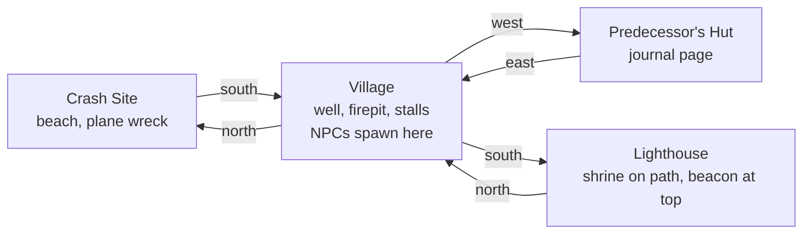
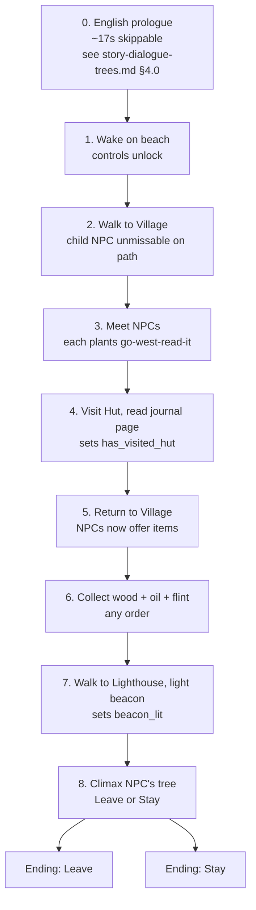
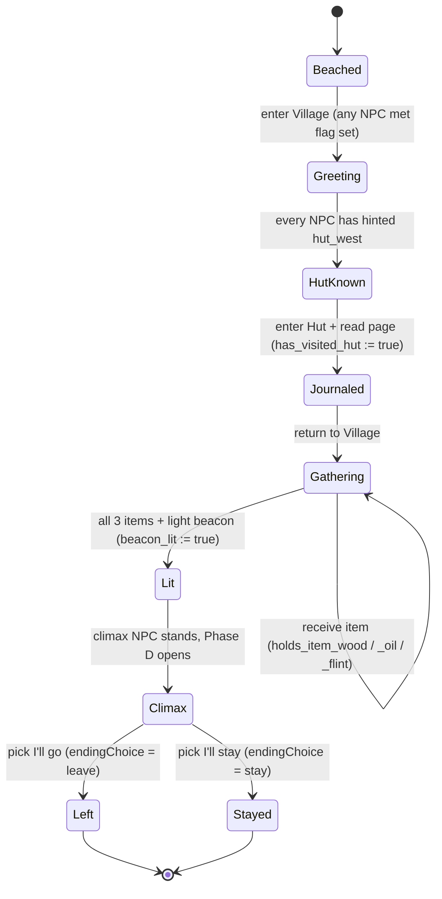
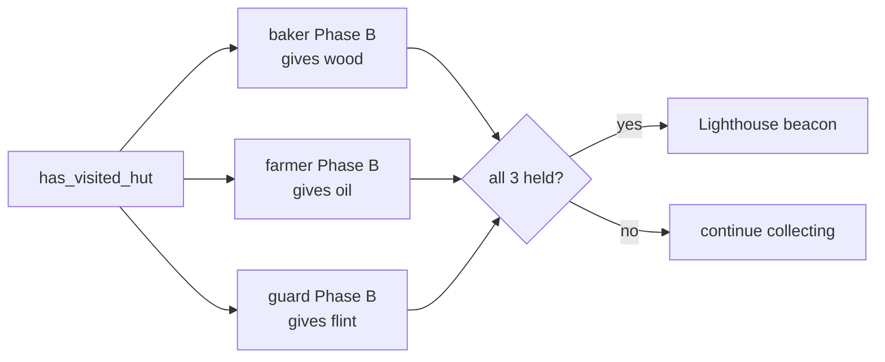
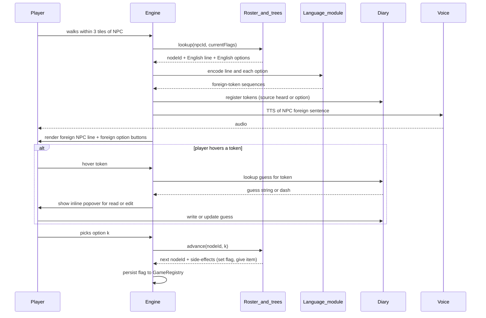

# Game flow — scene topology, quest state machine, conversation gating

**Status:** Draft v1, 2026-05-09.
**Companion to:** `story-dialogue-trees.md` (per-NPC branching trees & English copy).
**Purpose:** A higher-level map of how a playthrough flows from beach to ending — scene transitions, the quest state machine, and which flags unlock which conversation phase per NPC. Does **not** restate dialogue copy; cross-reference node IDs from `story-dialogue-trees.md` instead.

**Naming policy:** This doc references NPCs and the predecessor by **role** (`role: shrine-woman`) and **sprite key** (`npc_shrine`) only. All proper names — for villagers and the predecessor — are produced by the language-generation module at run-time and substituted via `{{predecessorName}}` / `{{npcName_<sprite_key>}}` tokens. Do not bake placeholder names into this doc; the trees doc owns the English-copy layer where placeholders are acceptable.

---

## 1. Scene topology

Mirrors the implemented transitions in `src/scenes/*.ts`.

| Scene | File | Role in critical path |
|---|---|---|
| Crash Site | `src/scenes/CrashSiteScene.ts` | Cold open. Player wakes; only exit is south → Village. |
| Village | `src/scenes/VillageScene.ts` | Hub. Hosts all 4 ordinary NPCs (sprite keys `npc_baker`, `npc_farmer`, `npc_guard`, `npc_child`). Three onward exits. |
| Hut | `src/scenes/HutScene.ts` | Predecessor's place. Reading journal flips `has_visited_hut`. |
| Lighthouse | `src/scenes/LighthouseScene.ts` | Climax NPC (`npc_shrine`) stationed on the path; beacon at the top. Final beat. |

> The shrine where the climax NPC sits is part of the Lighthouse scene (path approach), not its own scene.

---

## 2. Top-level player journey

The 8-beat loop, end-to-end. Beat 0 is the only English-rendered surface in the game body; everything from beat 2 onward is foreign.

**Time budget:** ~17s prologue + 5–10 min for the canonical path. Beats 3–6 are non-linear; everything else is gated.

**Beat 0 (prologue) responsibilities:** establishes the crash, the language barrier, the field-linguist role, and the hover-to-gloss affordance. It is the *only* place those four things are spelled out — the dialogue UI itself does not teach. Copy and beat-by-beat timing live in `story-dialogue-trees.md` §4.0.

**Beat 2 ordering constraint:** the child NPC (`npc_child`) must be physically on the path from Crash → Village interior, and ideally walks toward the player on entry. If the player encounters any other NPC first, the bootstrap vocabulary budget (§7.1 invariant 5) is wasted.

---

## 3. Quest state machine

Flags are the contract between the engine and the dialogue trees. Defined and consumed per `story-dialogue-trees.md` §1.2.

### 3.1 Flag glossary (authoritative — keep in sync with trees doc §1.2)

| Flag | Type | Set by | Read by |
|---|---|---|---|
| `met_<npc>` | bool, per NPC | first proximity within 3 tiles | switches `INITIAL` → `RETURN` greeting |
| `has_visited_hut` | bool | reading journal page in Hut scene | every NPC's Phase B gating |
| `holds_item_wood` / `_oil` / `_flint` | bool | NPC handover node side-effect | Phase C unlock + beacon trigger |
| `beacon_lit` | bool | placing all 3 items at lighthouse top | climax NPC's Phase D unlock |
| `endingChoice` | `"leave"` \| `"stay"` | climax NPC's `END_LEAVE` / `END_STAY` | end screen |
| `journal_words` | Set<lexicon-id> | hut journal pre-seeds 3–4 words | option-line word availability |

---

## 4. Per-NPC conversation gating

Cross-reference node IDs to `story-dialogue-trees.md` §4. Roles below correspond to the cast table in that doc; sprite keys are the engine handle.

| Role (sprite key) | Phase A trigger | Phase B trigger | Phase C trigger | Phase D trigger | Item |
|---|---|---|---|---|---|
| baker (`npc_baker`) | first proximity | `has_visited_hut` ∧ ¬`holds_item_wood` | `holds_item_wood` | — | wood |
| farmer (`npc_farmer`) | first proximity | `has_visited_hut` ∧ ¬`holds_item_oil` | `holds_item_oil` | — | oil |
| guard (`npc_guard`) | first proximity | `has_visited_hut` ∧ ¬`holds_item_flint` | `holds_item_flint` | — | flint |
| child (`npc_child`) | first proximity | `has_visited_hut` | — | — | — (colour) |
| shrine-woman / climax (`npc_shrine`) | first proximity | `has_visited_hut` ∧ no items | ≥1 item ∧ ¬`beacon_lit` | `beacon_lit` | — (climax) |

### 4.1 The Hut as universal gate

Every meaningful interaction past hello requires `has_visited_hut`. The four ordinary NPCs all plant the `hut_west` hint in their Phase A exit — the player gets the same nudge from up to four sources, so **missing it is unlikely**. The climax NPC explicitly refuses to talk past hello until the flag flips (see climax NPC's `*_NOT_YET` node in trees doc §4.5). This is the only hard gate in the game.

### 4.2 Item collection is order-independent

Each Phase C farewell hints at *another* uncollected NPC, so the player gets a soft tour even when wandering.

---

## 5. Soft-lock & dead-end audit

There are **no fail states** (REQUIREMENTS.md §3, restated in trees doc §1.3). The progression machine is engineered so the player cannot get stuck:

| Risk | Mitigation |
|---|---|
| Player wanders south to Lighthouse first | Climax NPC blocks at shrine via `INITIAL` → `NOT_YET` (trees doc §4.5), redirecting to the Hut. |
| Player visits Hut before talking to anyone | Allowed. Reading the journal still flips `has_visited_hut`; subsequent NPC meets jump straight to Phase B-eligible greeting on next approach. |
| Player asks for an item before Hut | Phase A trees don't expose the item-request option at all (gated). Friendly Phase A ending only. |
| Player drops an item | Items are inventory flags, not droppable entities — no recovery problem. |
| Climax option indecision | `HAL_MOMENT` loops back to `HAL_QUESTION` until choice. No timer. |

---

## 6. Optional / colour content

Not required to finish; texture only.

- **child NPC** — entire role. Tagging-along colour. Their Phase B "ask the climax NPC" hint is redundant with the guard/farmer Phase C hints.
- **baker / farmer / guard memory branches** — predecessor-flavoured options under each Phase B (see trees doc §4.1–§4.3). Loop back to the Phase B menu; player can skip entirely.
- **Climax NPC's emotional-depth nodes** — `*_LOVE`, `*_LETTER`, `*_RIGHT_CHOICE`, `*_WANTED_STAY` (trees doc §4.5). All funnel to the leave/stay question.

The deterministic demo seed (trees §9 Q4) hides the "stay" ending and walks the climax NPC's `OPEN → KNEW_PREDECESSOR → END_STORY → QUESTION → END_LEAVE` path.

---

## 7. Conversation presentation contract

The dialogue layer is fully immersive: every NPC line and every player-option label renders in the generated foreign language. The player's only translation surface is a diary they fill in themselves; the game never confirms or corrects a guess. This section is the contract that the engine, language module, and dialogue UI must jointly honour.

### 7.1 Invariants

1. **All-foreign rendering.** The dialogue panel never displays English for an NPC line or a player option. The English copy in `story-dialogue-trees.md` §4 is the *authoring* layer; runtime resolves each English string through the language module to a sequence of foreign tokens.
2. **No stage actions in player options.** Player gestures (waving, pointing, bowing) are conveyed by the player sprite, never by a `[Bracketed Action]` choice. Authors of new dialogue must express every player option as an utterance composable from the lexicon. NPC stage directions (italic, alongside the NPC line) stay — they describe NPC sprite animation, not player choice.
3. **Diary is the only gloss surface.** Hover over any token in the dialogue panel surfaces the player's own diary entry for that surface form, or `—` if no guess yet. There is no tooltip that reveals the true gloss; there is no "correct/wrong" feedback after picking a choice.
4. **Diary auto-population.** Every token the player has *seen* — from an NPC line OR a player-option button — is added to the diary on first appearance, source-tagged (`heard from <sprite_key>` / `seen as option`). Authors can rely on the diary having the relevant tokens by the time the player needs them.
5. **Bootstrap guarantee.** Two layers do this work jointly:
   - **§4.0 prologue** (English, ~17s, skippable) names the crash, the language barrier, the field-linguist role, and the hover-to-gloss affordance. It is the only English-rendered surface in the game body.
   - **The child NPC's Phase A tree** uses an intentionally tiny vocabulary (~3 lexemes: HI / ME / YOU), with sprite gestures supplying speech-act context. The child must be unmissable on the Crash → Village path so the player encounters them first.
   - **Per-option NPC reactions** (sprite animation, see `story-dialogue-trees.md` §8.1 rule 6) provide the per-pick learning signal so the player can tell which option meant what.
   - **Echo-heuristic guard** (§8.1 rule 7) prevents the child's tree from teaching a string-match strategy that would break in real conversations.

### 7.2 Activation sequence

How a single conversation comes to be:

The engine never invents nodes or words; the roster (`src/sim/dialogueTrees.ts`) is the dialogue source of truth and the language module is the lexicon source of truth. The diary is the only writable surface, and only the player writes to it.

### 7.3 Out of scope for the demo

- **Difficulty modes.** Demo ships analytical-only — every surface form is its own diary entry; no stem/suffix splitting. A future "hard mode" will let the player split stems from affixes via a diary editor.
- **Diary export, sharing, or seeding.** One playthrough, one diary, lives in session.
- **Truth-reveal end-of-run.** No reveal screen at the ending. The player walks away with whatever glosses they wrote.

---

## 8. Open questions for this doc

1. **Child NPC follow behaviour.** Does the child physically follow across scene boundaries (Crash → Village → Hut)? Affects whether their Phase B can fire while the player is inside the Hut.
2. **Beacon-lighting interaction.** Is "place items + light beacon" a single ritual interaction at the lighthouse top, or three separate placements + a final strike? Determines whether `beacon_lit` is one flag flip or staged. Recommend single ritual for demo simplicity.
3. **Re-enter Hut after `has_visited_hut`.** Does the journal page have additional content on revisit, or is it one-shot? Currently spec is silent; recommend one-shot with a mute "you've read this" on revisit.
4. **Save / resume granularity.** Are flags persisted across browser refresh, or is the 5–10 min loop assumed single-session? Affects whether `GameRegistry` needs serialization (currently it doesn't).

## Sources

- `agents/story-dialogue-trees.md` — per-NPC trees, English copy, flag definitions.
- `src/scenes/*.ts` — implemented scene transitions (matches §1).
- `src/sim/dialogueTrees.ts`, `src/sim/npcRoster.ts` — runtime dialogue source of truth.
- `src/state/GameRegistry.ts` — current flag persistence (minimal; will need extending per §3.1).
